  

ML-инженер с фокусом на LLM-системы, RAG и компьютерное зрение в продакшене.
Строю ассистентов на базе LLM, OCR-пайплайны и мультимодальные модели для работы
с документами; разворачиваю всё это on-premise и в air-gapped контурах для
корпоративного сектора — строительство, нефтегаз. До ML занимался fullstack
(Django/React) и тимлидил, поэтому довожу модели до полноценных сервисов, а не PoC.

---

### Сейчас работаю над

- **Text2BIM Agent** — мультиагентная LLM-платформа для автоматизации BIM-проектирования
  в Autodesk Revit. Текстовое описание &rarr; параметрические изменения в модели.
  FastAPI, AutoGen, MCP-интеграция с Revit (C#)
- **On-prem RAG** для строительной документации (ТУ, ТЗ, СНиП) — Qdrant, vLLM,
  LangGraph, air-gapped развёртывание

  

---

  

---

### 🧪 ML Portfolio

Четыре production-grade ML-проекта на общем cookiecutter-шаблоне. Полный стек: **PyTorch Lightning · Hydra · MLflow · DVC · FastAPI · Docker · GitHub Actions · MkDocs · HuggingFace Hub**.

| Проект | Задача | Главная модель | Метрики | Статус |
|---|---|---|---|---|
| [**chest-xray-classifier**](https://github.com/kiselyovd/chest-xray-classifier)   | 3-class pneumonia classification | ConvNeXt-V2-Tiny | acc **91.3%** · F1 **90.3%** · AUROC **97.5%** | ✅ v0.1.0 |
| [**brain-mri-segmentation**](https://github.com/kiselyovd/brain-mri-segmentation)   | Binary brain-tumor segmentation | SegFormer-B2 | Dice **65.5%** · IoU **66.2%** · Pixel acc **99.7%** | ✅ v0.1.0 |
| [**vehicle-keypoints**](https://github.com/kiselyovd/vehicle-keypoints)   | 14-keypoint car pose (CarFusion) | YOLO26-pose | Pose mAP50 · PCK@0.05 (на дообучении) | 🏃 Training |
| [**ml-project-template**](https://github.com/kiselyovd/ml-project-template)  | Cookiecutter scaffold для трёх выше | — | 12/12 meta-tests green | ✅ Stable |

Общие фичи для всех трёх моделей: patient-/scene-level сплиты без leakage, bilingual EN+RU README, multi-stage Docker, HF Hub model cards с виджетами, DVC-трекаемые артефакты, Python 3.12+3.13 matrix CI, ruff + mypy + deptry + bandit + interrogate + pre-commit quality gates.

---

### Другие репозитории

| Репозиторий | Описание |
|-------------|----------|
| [rag-pipeline-demo](https://github.com/kiselyovd/rag-pipeline-demo) | Модульный RAG-пайплайн — retrieval, reranking, generation |
| [llm-finetune-template](https://github.com/kiselyovd/llm-finetune-template) | Шаблон для fine-tuning LLM с LoRA/QLoRA через Unsloth |
| [dungeon-master-ai](https://github.com/kiselyovd/dungeon-master-ai) | D&D с AI — Clean Architecture, CQRS, FastAPI |
| [yolo-learn](https://github.com/kiselyovd/yolo-learn) | Практический курс по YOLO — 6 модулей |
| [cardio-risk-rf](https://github.com/kiselyovd/cardio-risk-rf) | Tabular-классификация сердечно-сосудистого риска (LightGBM + SHAP) · на рефакторинге |
| [grnti-text-classifier](https://github.com/kiselyovd/grnti-text-classifier) | Классификация научных статей по ГРНТИ (XLM-RoBERTa) · на рефакторинге |

---

### Активность

  

---

<!-- ### Контакты
[Telegram](https://t.me/TODO) · [Email](mailto:TODO) · [hh.ru](https://hh.ru/TODO)
-->

🇬🇧 English version

 

ML engineer focused on LLM systems, RAG, and computer vision in production.
I build LLM-based assistants, OCR pipelines, and multimodal document models;
deploy on-premise and in air-gapped environments for enterprise clients
(construction, oil & gas). Former fullstack developer and team lead
(Django/React) — I ship models as production services, not just PoCs.

### Currently working on

- **Text2BIM Agent** — multi-agent LLM platform for automating BIM design
  in Autodesk Revit. Natural language &rarr; parametric model changes.
  FastAPI, AutoGen, MCP integration with Revit (C#)
- **On-prem RAG** for construction documentation — Qdrant, vLLM, LangGraph,
  air-gapped deployment

  

---

### 🧪 ML Portfolio

Four production-grade ML projects sharing one cookiecutter template. Full stack: **PyTorch Lightning · Hydra · MLflow · DVC · FastAPI · Docker · GitHub Actions · MkDocs · HuggingFace Hub**.

| Project | Task | Main model | Metrics | Status |
|---|---|---|---|---|
| [**chest-xray-classifier**](https://github.com/kiselyovd/chest-xray-classifier) | 3-class pneumonia classification | ConvNeXt-V2-Tiny | acc **91.3%** · F1 **90.3%** · AUROC **97.5%** | ✅ v0.1.0 |
| [**brain-mri-segmentation**](https://github.com/kiselyovd/brain-mri-segmentation) | Binary brain-tumor segmentation | SegFormer-B2 | Dice **65.5%** · IoU **66.2%** · Pixel acc **99.7%** | ✅ v0.1.0 |
| [**vehicle-keypoints**](https://github.com/kiselyovd/vehicle-keypoints) | 14-keypoint car pose (CarFusion) | YOLO26-pose | Pose mAP50 · PCK@0.05 (training) | 🏃 Training |
| [**ml-project-template**](https://github.com/kiselyovd/ml-project-template) | Cookiecutter scaffold | — | 12/12 meta-tests | ✅ Stable |

Every repo ships: patient-/scene-level splits with no leakage, bilingual EN+RU README, multi-stage Docker, HF Hub model card with widgets, DVC-tracked artefacts, Python 3.12+3.13 matrix CI, full quality gates (ruff + mypy + deptry + bandit + interrogate + pre-commit).

---

  

### Activity

  

<!-- ### Contact
[Telegram](https://t.me/TODO) · [Email](mailto:TODO) · [hh.ru](https://hh.ru/TODO)
-->

